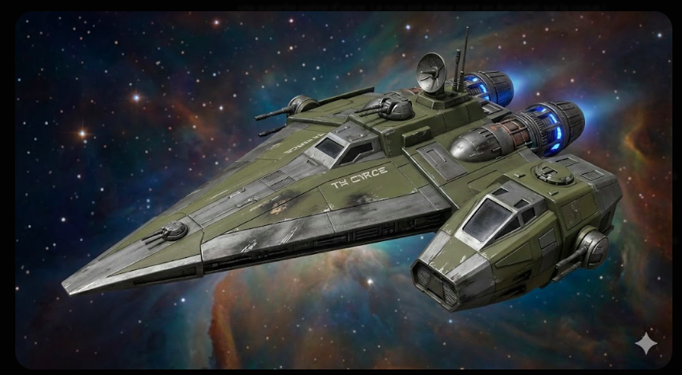

 

 

  
<strong>🤖 G3-M1 :</strong> <i>"Capitaine, le flux d'Aurebesh a été intercepté par un pare-feu impérial. J'ai dû forcer le rendu en mode ASCII-Tactique et mettre à jour vos signatures React."</i>

  
<strong>👩‍🚀 KANA NIVIX :</strong> <i>"Peu importe le code, G3. Tant que le message passe : on arrive."</i>

 

<h1 style="color: #FF0055; font-family: Orbitron, sans-serif; letter-spacing: 10px; border: 2px solid #FF0055; display: inline-block; padding: 10px 20px;">WANTED</h1>
<h2 style="color: #FF0055; font-family: Orbitron, sans-serif;">🚨 INDIVIDUS DANGEREUX 🚨</h2>

<i>Recherchés pour Slicing de haut niveau, Contrebande de données et Ironie non autorisée.</i>

<table border="0">
  <tr>
    <td align="center" width="45%">
      <h3 style="color: #0d6efd;">CIBLE A : L'OPÉRATRICE</h3>
      
      
<strong>KANA NIVIX</strong>

      
<small><i>Status : Slicer autodidacte. Expertise React & Full Stack.</i></small>

    </td>
    <td align="center" width="10%">
      
    </td>
    <td align="center" width="45%">
      <h3 style="color: #FF0055;">CIBLE B : LE COMPAGNON</h3>
      
      
<strong>DROÏDE G3-M1</strong>

      
<small><i>Status : Unité autonome. Processeur modifié. Gardien des données.</i></small>

    </td>
  </tr>
</table>

 

<code>01101011 ---<{(  DATA-LINK  )}>--- 01100001</code>

 

  <h2 style="color: #FF0055;">📂 RAPPORT DE RENSEIGNEMENTS (SKILLS)</h2>
  
  
<strong>Analyse du BSI :</strong> <i>"Individus utilisant des trophées technologiques volés aux infrastructures impériales."</i>

  
  
<strong>🤖 G3-M1 :</strong> <strike>"Infrastructures impériales"</strike> → <i>"On appelle ça du recyclage tactique, tas de ferraille."</i>

  <ul>
    <li><strong>⚡ PRIORITÉ FRONT-END :</strong> <code>REACT</code> / <code>JS</code> / <code>HTML</code> / <code>CSS</code></li>
    <li><strong>⚙️ INJECTION BACKEND :</strong> <code>JAVA</code> / <code>GO</code> / <code>SQLITE</code></li>
    <li><strong>📡 PROTOCOLES :</strong> <code>GIT</code> (Archives fantômes)</li>
  </ul>

 

<h2 style="color: #FF0055;">📈 TRACES DE L'INFILTRATION (STATS)</h2>

  

 

  <h3 style="color: #0d6efd;">⚠️ DERNIÈRE POSITION CONNUE : NORMANDIE</h3>
  
<i>Si vous apercevez le vaisseau "The Circe", ne tentez pas d'intercepter. Établissez une liaison Com-Link.</i>

  
  

    
  
<strong>🤖 G3-M1 :</strong> <i>"Transmission coupée. Le prochain qui essaie de nous tracer finira dans un trou noir informatique."</i>

